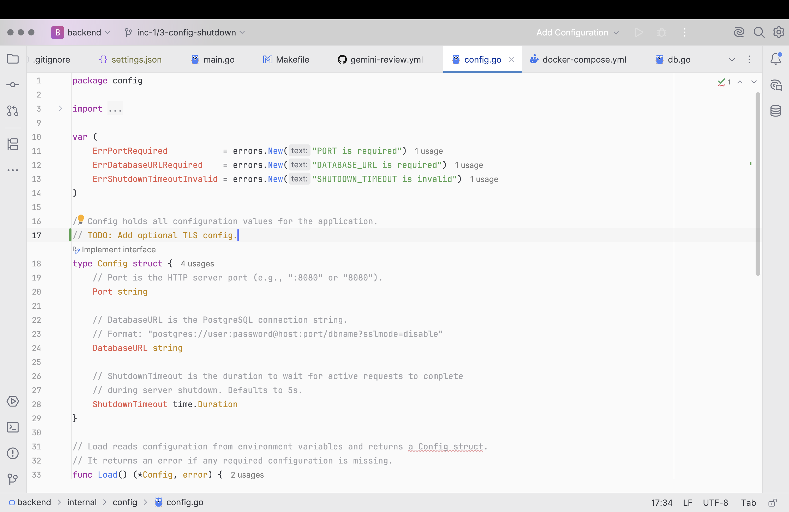

# One Light Theme

<!-- Plugin description -->
One Light theme for JetBrains IDEs. Based on the popular Atom One Light color scheme.

    <h3>Features</h3>
    <ul>
        <li>Light UI theme with clean, modern aesthetics</li>
        <li>Syntax highlighting for all major languages</li>
        <li>Optimized for readability</li>
        <li>Unique plugin icon for better visibility</li>
    </ul>
<!-- Plugin description end -->

## Installation

- Using the IDE built-in plugin system:

  <kbd>Settings/Preferences</kbd> > <kbd>Plugins</kbd> > <kbd>Marketplace</kbd> > <kbd>Search for "jetbrains-one-light-theme"</kbd> >
  <kbd>Install</kbd>

- Using JetBrains Marketplace:

  Go to [JetBrains Marketplace](https://plugins.jetbrains.com/plugin/29895) and install it by clicking the <kbd>Install to ...</kbd> button in case your IDE is running.

  You can also download the [latest release](https://plugins.jetbrains.com/plugin/29895/versions) from JetBrains Marketplace and install it manually using
  <kbd>Settings/Preferences</kbd> > <kbd>Plugins</kbd> > <kbd>⚙️</kbd> > <kbd>Install plugin from disk...</kbd>

- Manually:

  Download the [latest release](https://github.com/zulerne/jetbrains-one-light-theme/releases/latest) and install it manually using
  <kbd>Settings/Preferences</kbd> > <kbd>Plugins</kbd> > <kbd>⚙️</kbd> > <kbd>Install plugin from disk...</kbd>
